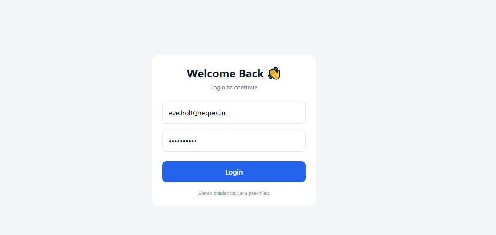

# 📱 Product App – React Native (Expo)

A modern **Product Listing Mobile Application** built using **React Native and Expo Router**.  
The app fetches products from a public API, displays them in a clean UI, supports search, and shows detailed product information.

This project focuses on **API integration, modern UI design, and navigation using Expo Router**.

---

## ✨ Features

- 📦 Product listing with clean card-based UI  
- 🔍 Search products by title  
- 📄 Product detail screen with image, price, and description  
- 🔄 Pull-to-refresh & infinite scrolling  
- 🧭 Navigation using Expo Router  
- 🎨 Improved UI colors and alignment  
- ⚡ Fast and lightweight  

---

## 🛠️ Tech Stack

- React Native  
- Expo  
- Expo Router  
- Context API  
- JavaScript / TypeScript  
- Fake Store API  

---

### 🏠 Product List Screen

### 🔍 login

### 📄 Product Detail Screen

---

